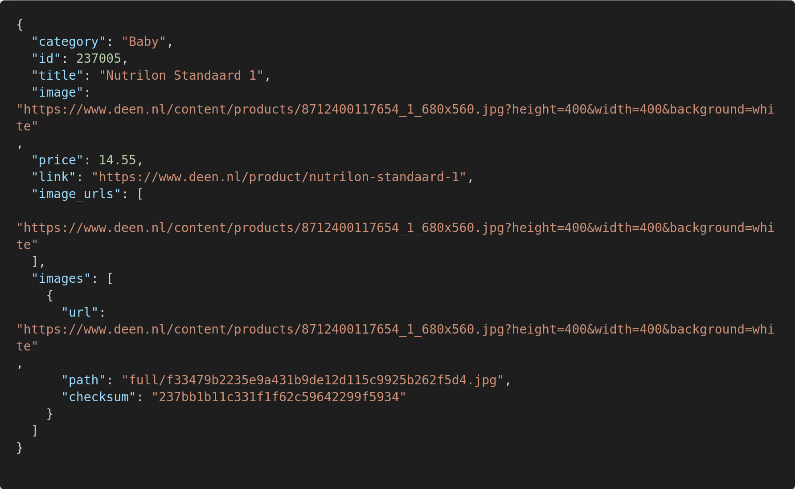

# [deen.nl](https://www.deen.nl/boodschappen) Product Scraper

> A [scrapy](https://scrapy.org/) bot that scrapes all available products from [deen.nl](https://www.deen.nl/boodschappen)



The above screenshot is a sample of one product entry scraped by bot.

# Install

Clone this repository:

```bash
git clone https://github.com/skdcodes/freelancer-bot-scrapy-deen.nl.git
cd freelancer-bot-scrapy-deen.nl
```

You will require `python3`, `pip3` and `mssql-server` installed.

We use `pyodbc` for making queries to SQL Server through Python. In order to compile its source you will need to follow these instructions for [Windows](https://github.com/mkleehammer/pyodbc/wiki/Install#installing-on-windows) or [Linux](https://github.com/mkleehammer/pyodbc/wiki/Install#installing-on-linux).

If you're working on Linux then you will need to install the SQL Server driver for linux as per these [instructions](https://docs.microsoft.com/en-us/sql/connect/odbc/linux-mac/installing-the-microsoft-odbc-driver-for-sql-server?view=sql-server-ver15).

Fianlly, make sure the `pyodbc` is able to detect the drivers by running:

```bash
$ python3
iPython 3.6.9 (default, Apr 18 2020, 01:56:04)
[GCC 8.4.0] on linux
Type "help", "copyright", "credits" or "license" for more information.
>>> import pyodbc
>>> pyodbc.drivers()
['ODBC Driver 17 for SQL Server']

```

You should see a specific driver that `pyodbc` has been able to detect. This confirms that everything was installed properly.

Install python dependencies:

```bash
pip3 install -r requirements.txt
```

# Usage

Run the scrapy bot:

```bash
scrapy crawl deen
```

# Features

You can enable and disable various pipelines through `scrapy_deen/spiders/products.py` by commenting/un-commenting the following lines.

```python
# scrapy_deen/spiders/products.py

"ITEM_PIPELINES": {
   'scrapy.pipelines.images.ImagesPipeline':1 # enables images pipeline
   'scrapy_deen.pipelines.SQLPipeline':2 # enables sql pipeline
}
```

- The files pipeline saves products locally in `dumps/data.jl`. The location can be modified by the parameter `FEED_URI` in crawler. The feed exported pipeline is automatically enabled when this option is set.

- The images pipeline downloads product images concurrently to `dump/images`. The location can be modified by the parameter `IMAGES_STORE` in crawler.

- The SQL pipeline creates / inserts / updates products to a table `products` under a database `deen`. All database related parameters can be updated in crawler.

# Notes

- A total of `3,782` products are available and were scraped successfully by this bot as of this writing `May 19 2020`.
- You can retrieve all their products by changing the items parameter: [https://www.deen.nl/boodschappen?items=10000](https://www.deen.nl/boodschappen?items=10000)
- You can create a local MS SQL Server 2017 instance for Ubuntu through [docker](https://hub.docker.com/_/microsoft-mssql-server) by running:

  ```bash
  docker run -e 'ACCEPT_EULA=Y' -e 'SA_PASSWORD=yourStrong(!)Password' -p 1433:1433 -d mcr.microsoft.com/mssql/server:2017-CU8-ubuntu
  ```

  However, you might run into an error `[01000] [unixODBC][Driver Manager]Can't open lib 'ODBC Driver 17 for SQL Server' : file not found (0) (SQLDriverConnect)`. This is because the configuration files that `pyodbc` library is looking for are not mounted on your host system on default. You can see [here](https://stackoverflow.com/questions/44527452/cant-open-lib-odbc-driver-13-for-sql-server-sym-linking-issue) why this error occurs when the **host has installed SQL Server**. However, in our case, these files from the docker container should be me mounted to the host file system.

  More complications might arise after this is fixed. Using docker SQL server container with `pyodbc` on host is not be recommended for the faint hearted.
